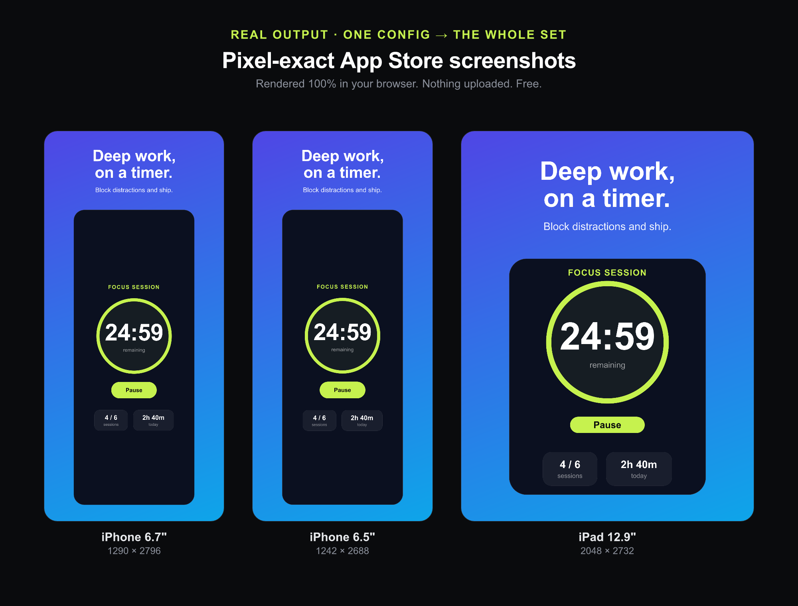

<h1 align="center">ShipShots</h1>

  <b>App Store screenshots from one config — pixel-exact, rendered 100% in your browser. Free.</b> 
  <a href="https://percymcn.github.io/shipshots/"><b>→ Open ShipShots</b></a>

  

Real output — one config renders all three exact App Store sizes (1290×2796 · 1242×2688 · 2048×2732), entirely in your browser.

---

Every App Store release, you redo the same screenshots: three device sizes, a few frames each, resizing and re-exporting in Figma, fixing the one that's 4px off. ShipShots turns that into a config.

You edit a small set of frames — headline, caption, colors, your app image — and it renders **pixel-exact PNGs at the exact App Store dimensions** (iPhone 6.7", iPhone 6.5", iPad 12.9"), then zips them. Change one line, regenerate the whole set.

## Why it's different

- **Config over clicking.** The GUI tools (Screenshots.pro, Previewed, AppMockUp) make you re-click every size and frame, every release. ShipShots is built for people who ship often — set it once, re-run it forever.
- **100% in your browser.** The render (satori → resvg-wasm → zip) runs in your tab. **Nothing is uploaded** — your unreleased app art never leaves your machine. Works offline.
- **No signup. Free.** Open the link, build your set, download the zip.

## How it works

1. Open [shipshots](https://percymcn.github.io/shipshots/).
2. Set your frames (headline, caption, colors) and drop in your app image.
3. Hit generate — get correct-dimension PNGs for iPhone 6.7", 6.5", and iPad 12.9", zipped.

## Built with

Static page, no backend. [`satori`](https://github.com/vercel/satori) (JSX → SVG) → [`@resvg/resvg-wasm`](https://github.com/thx/resvg-js) (SVG → PNG) → [`fflate`](https://github.com/101arrowz/fflate) (zip) — all client-side. Hosted on GitHub Pages.

## This is an early v1 — tell me what's missing

Honest question for anyone who ships iOS apps: does *config-as-source-of-truth* fit how you actually make screenshots, or is the manual visual control worth more to you? What device or frame presets are you missing? Open an issue — I'm listening.

---

<a href="https://percymcn.github.io/shipshots/"><b>Open ShipShots →</b></a>

